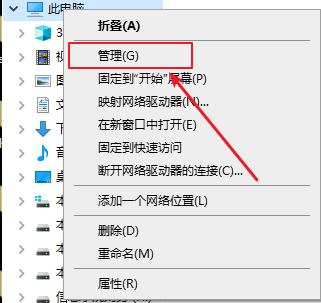

# 自动进行每日填报的脚本

## 依赖

- python 3.7
- requests==2.20
- pyyaml==5.4.1

## 配置方式

1. 安装conda

   [win10 环境下的下载地址在这里](https://mirrors.tuna.tsinghua.edu.cn/anaconda/archive/Anaconda3-2021.05-Windows-x86_64.exe)

   下载安装包，右键单击以管理员的身份运行

   一路点击继续

2. 创建conda 环境

   - 安装完conda之后打开Anaconda Prompt,依次运行
   - conda create -n daily_report python=3.7
   - conda activate daily_report
   - pip install requests==2.20
   - pip install pyyaml

3. 设置配置文件

   - 发送邮件的配置

     - 打开项目的目录下有config.yaml文件，其中

       - mail_pass ：参数为邮箱授权码,需要开启邮箱的SMTP服务，[163邮箱参见这里，qq邮箱同理](https://note.youdao.com/ynoteshare/index.html?id=f9fef46114fb922b45460f4f55d96853&type=note&_time=1632986174349)
       - mail_account： 为你的邮箱账号，比如xxx@163.com
       - mail_host ：为你使用的邮箱服务器如163的邮箱服务器为：smtp.163.com
       - send_config ：是否发送邮件的全局开关，开启填true， 关闭填false

       如果不打算接收邮件通知，前三个参数可以随便填，最后一个填false即可，**前三个参数需要用引号引起来，最后一个不用**

   - 填报信息的设置

     - 打开项目下的user_config_example.json文件，每个json格式的对象对应一个填报信息，**注意每个json格式的信息占一行，不能换行**， 其中
       - uuid_number：填报人的学号
       - uuid_name：填报人的姓名
       - class_num：你是哪一级的，如2021级
       - mor：早上的体温
       - aft：中午的体温
       - ni：晚上的体温
       - trail：一天的轨迹
       - people：密切接触的人群
       - email：你的邮箱
       - is_send：是否发送信息的个人开关

4. 设置自动进行每日填报

   - Windows 10下
     - 鼠标右击我的电脑选择管理

       

     - 选择任务计划程序下的Windows

       

     - 选择创建任务

       

     - 填写内容

       

       

       

       

       

       

       

       

       

       

       
   - Linux
     - 待更

5. 不想安装环境可以下载打包好的[exe文件](https://github.com/YanceyCodeForFun/daily_report/releases)

6. 如果遇到问题的话，可以开个Issues,有好的改进方案欢迎拉个pr

7. 最后，喜欢本项目的话可以给个star。😀🥰
